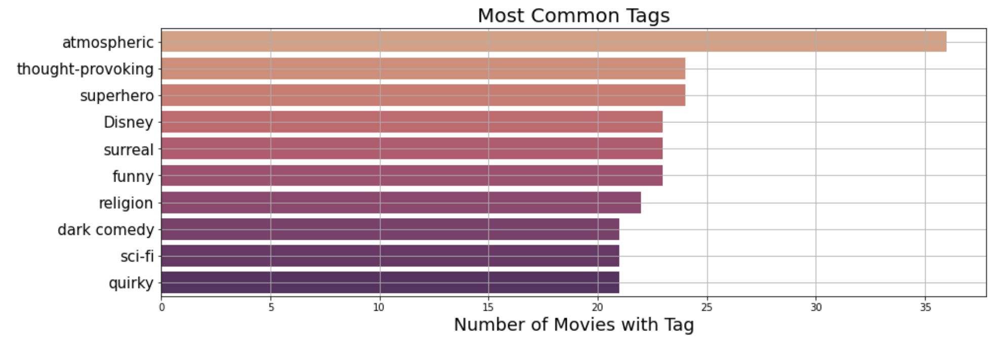
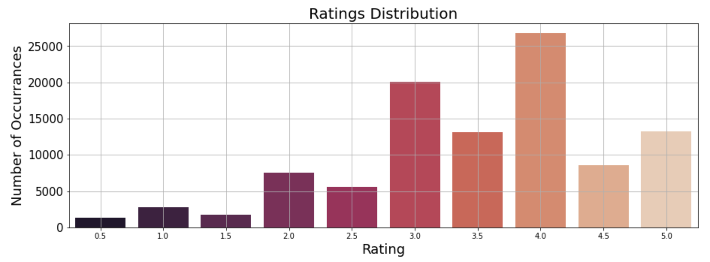

# dsc-phase-4-project

## Project Overview

This project uses a recommendation engine to generate the top 5 movie recommendations for a movie rating user base, and genrates recommendations for the users with no rating data, and tracks the top 10 movie recommendations overall 

### Business Problem

### We are a streaming service that wants to increase the value of it's service and grow it's user and movie base.

Goal: create a recommendation engine that will accurately predict movies that our users will rate highly.

Benefits:
1. Keeps our existing users coming back
    - Recommending movies they like and showing them movies they haven't seen will keep them interested
2. Helps identify movies to add to the service
    - New content will give users more movies to watch, keeping them on the service longer
3. Attracts new users
    - A well curated collection of movies will encourage streamers to use our service

### The Data

The data used in the project is a rating data sets from the MovieLens web site (https://movielens.org) collected by GroupLens Research. The particular dataet used is the ml-latest-small set. 

This dataset describes 5-star rating and free-text tagging activity from MovieLens, a movie recommendation service. It contains: 
- 100836 ratings 
- 3683 tag applications
- 9742 movies
- 610 users 

This is a small, development dataset collected between March 29, 1996 and September 24, 2018, and was generated on September 26, 2018. 

Users were selected at random for inclusion. All selected users had rated at least 20 movies. 
- Each user is represented by an id, and no other information is provided. 

The data are contained in the files:
- data/links.csv
- data/movies.csv
- data/ratings.csv 
- data/tags.csv. 

### Data Overview

Most common tags used to describe movies:

Most common movie genres:

Ratings distribution:

### Analysis

The primary analysis work can be found in the jupityer notebook 'data_analysis.ipynb'

#### Data Cleaning: 
    - remove un necessary columns from the MovieLens DataFrames

#### Data Analysis: 

##### Base Model: 
do I have a base model and do I need amodel

##### KNN Methods:

##### SVD Grid Search:
The ranges of values selected for each parameter during hyperparamter tuning were permutated to produce all possible combinations of parameters to search for the combination that produces the highest possible precision. 

##### Final Decision Tree:
The optimal paramters were used to generate a final decision tree, resulting in a precision of 80.1%

#### Final Model

##### Singular Value Decomposition:

### Recommendations

1.  
2. 
3. 

### Repository Structure
images Folder: images used in this ReadMe
data Folder: contains the original MovieLens data set .
pdfs Folder: contains the pdfs turned in as part of this project, including the presentation
data_analysis.ipynb: the jupyter notebook containing the primary analyses

### Contact Information

Abigail Campbell
abbycampbell0@gmail.com