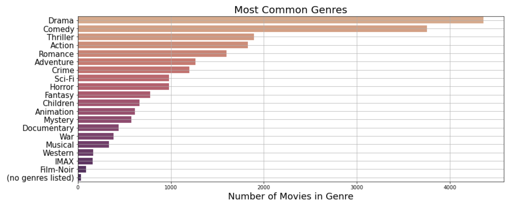
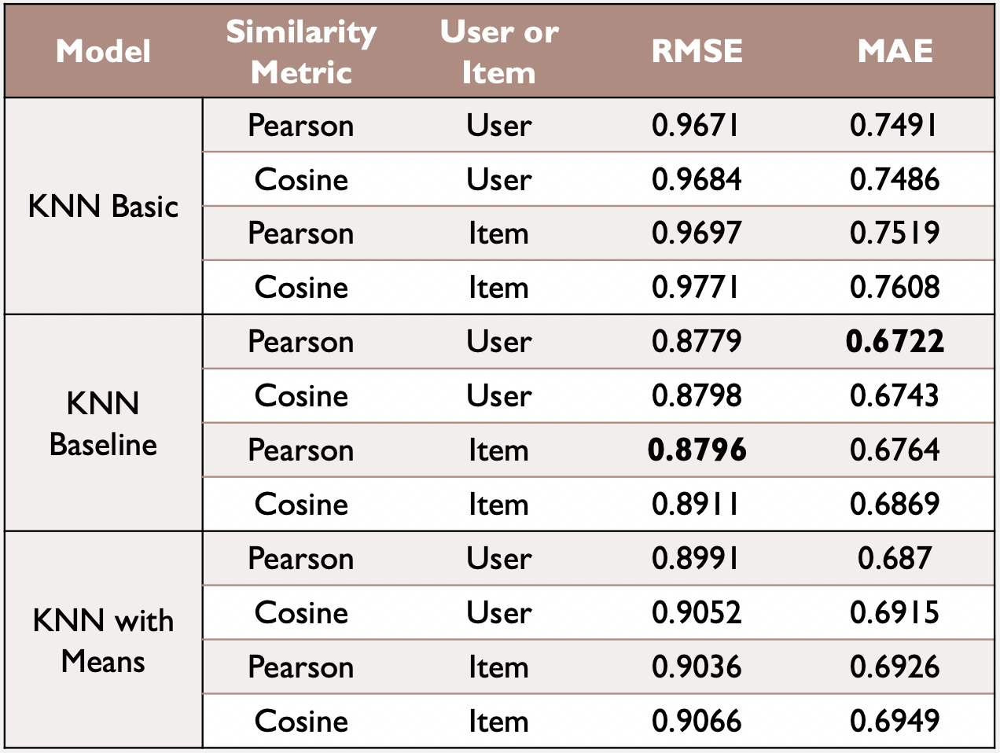
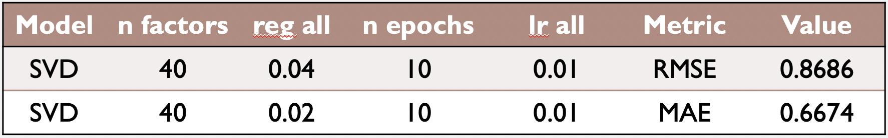
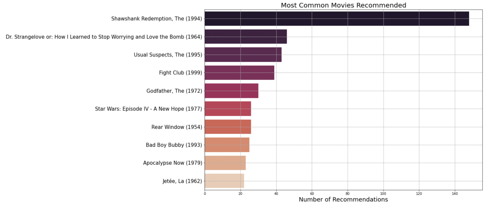

# Movie Recommendation Engine

## Project Overview

This project uses a recommendation engine to generate the top 5 movie recommendations for a movie rating user base, and genrates recommendations for the users with no rating data, and tracks the top 10 movie recommendations overall 

### Business Problem

### We are a streaming service that wants to increase the value of it's service and grow it's user and movie base.

Goal: create a recommendation engine that will accurately predict movies that our users will rate highly.

Benefits:
1. Keeps our existing users coming back
    - Recommending movies they like and showing them movies they haven't seen will keep them interested
2. Helps identify movies to add to the service
    - New content will give users more movies to watch, keeping them on the service longer
3. Attracts new users
    - A well curated collection of movies will encourage streamers to use our service

### The Data

The data used in the project is a rating data sets from the MovieLens web site (https://movielens.org) collected by GroupLens Research. The particular dataet used is the ml-latest-small set. 

This dataset describes 5-star rating and free-text tagging activity from MovieLens, a movie recommendation service. It contains: 
- 100836 ratings 
- 3683 tag applications
- 9742 movies
- 610 users 

This is a small, development dataset collected between March 29, 1996 and September 24, 2018, and was generated on September 26, 2018. 

Users were selected at random for inclusion. All selected users had rated at least 20 movies. 
- Each user is represented by an id, and no other information is provided. 

The data are contained in the files:
- data/links.csv
- data/movies.csv
- data/ratings.csv 
- data/tags.csv. 

### Data Overview

#### Most common tags used to describe movies:

There is a diverse set of common tags, that indicate that there is a wide range of movies that will appeal to many movie preferences.

#### Most common movie genres:

Drama and comedy are the most common genres.

#### Ratings distribution:

The users in this dataset tend to be generous in their ratings, with higher numbers of ratings in the range of 3-5 than 1-2.  

### Analysis

The primary analysis work can be found in the jupityer notebook 'data_analysis.ipynb'

#### Data Cleaning: 
Not much data cleaning was necessary, there were no null values in the dataset, as it was a pre-filtered and currated dataset. The only cleaning performed was to remove unnecessary columns from the individual csv files, primarily the timestamp columns.

#### Data Analysis: 

Several models were built in order to find the model with the highest accuracy, including several K-Nearest Neighbor (KNN) algorithms and Singular Value Decomposition (SVD)

##### KNN Methods:
Three K-Nearest Neighbor methodes were tested.
1. KNN Basic
2. KNN Baseline
3. KNN with Means

Two parameters were varied for each method
1. pearson vs cosine similarity score
2. user-user vs item-item comparrision

This resulted in 12 total models. 

Each model was run and evaluated to determine it's error scores. Both the root mean squared error (rmse) and mean absolute error (mae) were calcualted for each model, with the rmse used as the decison metric for determining the final model, due to the assumption of a normal (gaussian) error.

#### The following table indicates the performance for each model.

##### SVD Grid Search:
The ranges of values selected for each parameter during hyperparamter tuning were permutated to produce all possible combinations of parameters to search for the combination that produces the highest possible precision. 

#### The following table indicates optimal parameters tuned to both RMSE and MAE.

#### Final Model: SVD with optimal parameters
The SVD Grid search optimal paramters produced the lowest RMSE error of 0.869
    
    - n_factors = 80
    - reg_all = 0.05
    - n_epochs = 10
    - lr_all = 0.01

### Recommendation Strategies

1. Current User: Recommend movies similar to ones they have rated highly and fit their top tags and genres   
2. New User: Prompt to give 3 key words, then recommend top movies containing those 3 words
3. Mystery User: If no key words are given, recommend the top 5 highest rated movies

#### Top 10 Most rated movies

The top 10 movies most recommended among the  610 users in the dataset, with The Shawshank Redemption being recommended the most, with a total 145 recommendations.

## Conclusion
Recommending movies to users that they will enjoy will increase the value of our streaming service by:
1. Keeping current users hooked
2. Attracting new users 
3. Helping to identify new movies to add

### Repository Structure
    - images Folder: images used in this ReadMe
    - data Folder: contains the original MovieLens data set .
    - pdfs Folder: contains the pdfs turned in as part of this project, including the presentation
    - data_analysis.ipynb: the jupyter notebook containing the primary analyses

### Contact Information

Abigail Campbell
abbycampbell0@gmail.com